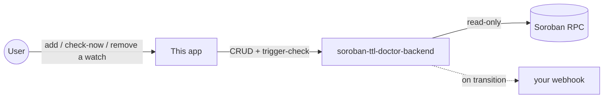

# soroban-ttl-doctor-frontend

Dashboard for [`soroban-ttl-doctor-backend`](https://github.com/soroban-doc-ttl/soroban-ttl-doctor-backend):
add contracts/entries to watch, see their TTL status at a glance, trigger
an immediate check, or remove a watch.

Part of a four-repo project:

- [`soroban-ttl-doctor`](https://github.com/soroban-doc-ttl/soroban-ttl-doctor) — the core checking library + CLI.
- [`soroban-ttl-doctor-backend`](https://github.com/soroban-doc-ttl/soroban-ttl-doctor-backend) — the scheduled monitoring API this frontend calls.
- **This repo** — the dashboard.
- [`soroban-ttl-doctor-action`](https://github.com/soroban-doc-ttl/soroban-ttl-doctor-action) — CI-native alternative that doesn't need this whole stack running.



Like [`sep24-conformance-frontend`](https://github.com/SEP-24-conform/sep24-conformance-frontend),
this repo has no logic of its own beyond presentation — every watch,
check, and verdict is real work done by the backend.

## Table of contents

- [Glossary](#glossary)
- [What it does](#what-it-does)
- [Design system](#design-system)
  - [Token reference](#token-reference)
  - [The glass surface](#the-glass-surface)
  - [The sweep interaction](#the-sweep-interaction)
  - [The drifting background](#the-drifting-background)
  - [Why a cooler palette than sep24-conformance-frontend](#why-a-cooler-palette-than-sep24-conformance-frontend)
  - [Accessibility](#accessibility)
- [Component tree](#component-tree)
- [Data flow](#data-flow)
- [Reading a watch card](#reading-a-watch-card)
- [Configuration](#configuration)
- [Running locally](#running-locally)
- [Verification](#verification)
- [Project layout](#project-layout)
- [Framework notes: built on Next.js 16](#framework-notes-built-on-nextjs-16)
- [Design decisions](#design-decisions)
- [What's not here yet](#whats-not-here-yet)
- [FAQ](#faq)
- [Contributing](#contributing)
- [License](#license)

## Glossary

See [`soroban-ttl-doctor`'s glossary](https://github.com/soroban-doc-ttl/soroban-ttl-doctor#glossary)
for the underlying TTL/verdict vocabulary (`ok`/`warn`/`expired`, durability,
instance vs. entry). The one term specific to this repo:

| Term | Meaning |
|---|---|
| **Watch** | The unit this dashboard manages — a saved (contract, target, threshold) triple the backend re-checks on schedule. Defined and owned by `soroban-ttl-doctor-backend`; this app only reads and mutates it through that API. |

## What it does

A single-page dashboard:

1. **Add a watch** — name, contract ID, target (contract instance, or a
   named `enum DataKey { Variant(T) }` entry), and a warn-days threshold.
2. **See every watch's status** — verdict badge (`ok` / `warn` / `expired`),
   estimated days remaining, when it was last checked.
3. **Check now** — trigger an immediate check outside the backend's
   schedule.
4. **Remove** a watch.

No polling/auto-refresh loop currently — the list refreshes after any
action taken through the UI (add, check, delete), not on a timer. See
[Design decisions](#design-decisions).

## Design system

Same "liquid glass" recipe as
[`sep24-conformance-frontend`](https://github.com/SEP-24-conform/sep24-conformance-frontend#design-system):
translucent frosted panels (`backdrop-filter: blur(18px)`), a CSS-only
drifting backdrop (no video asset), pill controls, hairline borders, and a
diagonal sweep highlight on hover — reused deliberately rather than
reinvented, since it's already a verified, working design language built
for that project. Reproduced here in full rather than only linked to,
since a reader shouldn't have to open a second repo to know what this one
looks like.

### Token reference

| Token | Light | Dark | Used for |
|---|---|---|---|
| `--ink` | `#1c2024` | `#edf0f2` | Primary text |
| `--bg` | `#eef1f3` | `#0b0d10` | Page background — cool slate, not stark white/black |
| `--bg-glow-a` / `--bg-glow-b` | `#cfd9e6` / `#d8cfe6` | `#16233a` / `#241a36` | The two blurred, drifting background blobs — blue and violet rather than sep24-conformance-frontend's teal/tan |
| `--glass` | `rgba(255,255,255,0.5)` | `rgba(255,255,255,0.045)` | Fill for `.glass` panels (nav, form fields, watch cards) |
| `--glass-strong` | `rgba(255,255,255,0.72)` | `rgba(255,255,255,0.09)` | Fill for `.glass-strong` (the add-watch form card — needs more contrast than list rows) |
| `--hairline` | `rgba(60,70,85,0.16)` | `rgba(255,255,255,0.13)` | 1px borders on every glass surface |
| `--sweep` | `rgba(255,255,255,0.85)` | `rgba(255,255,255,0.5)` | The hover sweep gradient |
| `--pass` / `--warn` / `--fail` | `#0f6e5c` / `#a3762c` / `#a3402c` | `#4fd8ba` / `#e8b768` / `#f0876c` | Verdict badges: `ok` / `warn` / `expired` |
| `--muted` | `#5b6470` | `#9aa4b1` | Secondary text |

Note the three-way status palette (`pass`/`warn`/`fail`) — one more state
than `sep24-conformance-frontend` needs, since that app only ever shows
pass/fail. This is a deliberately semantic color set, kept separate from
any decorative accent: its only job is letting severity read at a glance,
which is why every badge still carries the text label too rather than
relying on color alone (see [Accessibility](#accessibility)).

### The glass surface

```css
.glass {
  background: var(--glass);
  backdrop-filter: blur(18px);
  border: 1px solid var(--hairline);
  border-radius: 24px;
  box-shadow: 0 1px 2px var(--shadow);
}
```

Elevation comes from the blur and translucency, not a heavy drop shadow —
the shadow here is a 1px hint. Identical mechanism to
`sep24-conformance-frontend`'s `.glass`; only the token *values* feeding it
differ per app.

### The sweep interaction

```css
.sweep:hover::after, .sweep:focus-visible::after {
  opacity: .35;
  animation: sweep 1.1s cubic-bezier(.4,0,.2,1);
}
```

A diagonal highlight sweeps across a card or button on hover/keyboard
focus — every `.glass`/`.glass-strong` surface in this app (nav, form,
watch cards) carries `.sweep`, so the whole interface feels uniformly
"live glass," not just the primary action.

### The drifting background

Two large, heavily-blurred (`blur(80px)`), slowly-animated color blobs
(`.backdrop-field::before`/`::after`) sit behind every glass panel,
recreating the effect a real moving backdrop (video, in the original
reference aesthetic) gives glass to refract — without shipping a media
asset. See
[`sep24-conformance-frontend`'s fuller writeup](https://github.com/SEP-24-conform/sep24-conformance-frontend#the-drifting-background)
of why a video wasn't reused here.

### Why a cooler palette than sep24-conformance-frontend

The two products share a design *language*, not a brand — this dashboard
monitors infrastructure health for a different tool, under a different
GitHub org (`soroban-doc-ttl` vs. `SEP-24-conform`), and giving it the
exact same warm parchment palette would make the two look like the same
product rather than siblings from the same toolmaker. A cooler
slate/blue-violet backdrop, with the same warm-vs-cool logic reversed
(blue/violet glow blobs instead of teal/tan), keeps the mechanism
identical while the product reads as distinct at a glance — useful given
this dashboard's whole job is telling infrastructure states apart quickly.

### Accessibility

- `prefers-reduced-motion: reduce` disables the background drift and the
  sweep animation entirely, same as `sep24-conformance-frontend`.
- Verdict is never color-only: every badge shows its state as text
  (`ok`/`warn`/`expired`), not just a color chip.
- Real `<button>`/`<input>`/`<select>` elements throughout the add-watch
  form and watch-card actions — no clickable `<div>`s, so keyboard
  navigation and screen readers get correct semantics without extra ARIA.

## Component tree

```text
app/
  layout.tsx        root layout: fonts, metadata, renders .backdrop-field once
  page.tsx           the entire dashboard: fetches watches, composes the pieces below
  globals.css         design tokens (see Design system)
components/
  Nav.tsx             top bar: brand + GitHub link
  AddWatchForm.tsx     client component: instance vs. entry target fields, submits via lib/api
  WatchCard.tsx        one watch's status badge + days-remaining + check-now/remove actions
lib/
  api.ts               typed fetch wrappers matching the backend's WatchedEntry/CreateWatchInput shapes
```

## Data flow

`page.tsx`, `AddWatchForm`, and `WatchCard` are all Client Components
(`"use client"`) that call `lib/api.ts` directly from the browser against
`NEXT_PUBLIC_API_URL` — no Next.js server-side data fetching or API route
in this app. `page.tsx` owns the single source of truth (the watch list)
and passes a `refresh` callback down to both `AddWatchForm` and each
`WatchCard`, so any action (add, check, delete) re-fetches the whole list
rather than each component managing its own optimistic local state — see
[Design decisions](#design-decisions) for why that trade-off was made.

## Reading a watch card

```text
┌─────────────────────────────────────────────────────────┐
│ registry-instance  [ok]                Check now  Remove │
│ CAPB...SUR3 · instance                                    │
│ ~57.8 days remaining                                      │
└─────────────────────────────────────────────────────────┘
```

- **Name + verdict badge** — `ok` (green), `warn` (amber), or `expired`
  (red), always paired with the text label, never color-only.
- **Contract ID + target summary** — `instance`, or
  `Variant(fieldValue)` for a named entry (e.g. `Attestation(testanchor.stellar.org)`).
- **Days remaining** — omitted entirely if the watch has never been
  checked yet (`lastCheckedAt` absent), rather than showing a misleading
  zero or dash.

## Configuration

| Variable | Default | Description |
|---|---|---|
| `NEXT_PUBLIC_API_URL` | `http://localhost:3001` | Base URL of `soroban-ttl-doctor-backend`. |

## Running locally

```sh
cp .env.example .env.local   # only needed if your backend isn't on localhost:3001
npm install
npm run dev
```

Needs `soroban-ttl-doctor-backend` running — every piece of data on this
page comes from it.

## Verification

Same honest caveat as `sep24-conformance-frontend`: this was built without
a browser automation tool available, so verification was `next build`
succeeding, the served HTML containing the expected `backdrop-field` /
`glass sweep` markup (confirmed via `curl` against a locally running
instance), and a real watch created directly against a locally running
backend to confirm the two integrate. The visual result — whether the
glass/blur/sweep effect actually renders as intended — has not been
confirmed in an actual browser; run `npm run dev` and look before relying
on this for anything.

## Project layout

```text
app/
  layout.tsx
  page.tsx
  globals.css
components/
  Nav.tsx
  AddWatchForm.tsx
  WatchCard.tsx
lib/
  api.ts
```

## Framework notes: built on Next.js 16

Same situation as `sep24-conformance-frontend`: scaffolded with
`create-next-app@latest`, which produced Next.js 16.3.4 — newer than most
AI coding assistants' training data, including the one that built this.
Next.js 16 ships an `AGENTS.md` in this repo pointing at version-matched
docs bundled in `node_modules/next/dist/docs/` specifically so an agent
reads the current API surface (Turbopack default, `middleware.ts` renamed
`proxy.ts`, several previously-synchronous APIs now async) rather than
assuming an older version's conventions. That file is regenerated by
`next dev`; seeing it in a diff is expected. This app is simple enough
(one client-rendered page, no dynamic routes, no middleware/proxy, no
server actions) that almost none of the version-16-specific breaking
changes actually apply here.

## Design decisions

**Why refresh the whole watch list after every action instead of updating
just the affected card locally?** Simplicity and correctness over a minor
snappiness gain: the backend is the source of truth for verdicts and
timestamps, and re-fetching guarantees the UI reflects exactly what the
backend just did (including server-computed fields like `lastCheckedAt`)
rather than a client-side guess at what changed. At this app's scale (a
handful of watches, actions that already involve a network round-trip),
the extra fetch is not a meaningful cost.

**Why no auto-refresh polling?** The backend's own scheduler already
re-checks everything periodically (default every 6 hours — see its
README); polling the dashboard every few seconds for changes that happen
on an hours-long cadence would be all cost, no benefit. Refreshing after
a user-initiated action (add/check/delete) covers the case that actually
matters: seeing the result of something you just did.

**Why one page instead of separate add/list routes?** The CRUD surface
here is small enough (one form, one list) that splitting it across routes
would add navigation for no organizational benefit — unlike
`sep24-conformance-frontend`, which has two genuinely distinct concerns
(run a check vs. browse history).

**Why reuse sep24-conformance-frontend's exact CSS mechanism instead of a
component library?** Same reasoning as that project's own choice: the
whole point is a specific, deliberately-chosen visual treatment, legible
in one `globals.css` file rather than fighting a library's defaults or
spreading tokens across library-specific theme configuration.

## What's not here yet

- **No manual light/dark toggle** — follows system preference only, same
  gap as `sep24-conformance-frontend`.
- **No pagination** — `GET /api/watches` returns everything in one
  response; fine at low watch counts, would need pagination on both ends
  at scale.
- **No inline validation feedback** on the add-watch form beyond the
  browser's native `required` attribute — a malformed contract ID isn't
  caught until the backend's `400` response comes back.
- **No confirmation prompt before Remove** — clicking it deletes
  immediately. Low risk (watches are cheap to re-add), but worth flagging.

## FAQ

**Does this show historical TTL trends over time?** No — the backend only
retains the latest status per watch (see its README), so there's no
history to chart. A watch's card shows its most recent check only.

**What happens if I add a watch with a typo'd variant name or wrong field
kind?** The backend can't distinguish "wrong key" from "genuinely
expired" — both look like `found: false` / verdict `expired`. Double-check
the target fields against the contract's actual Rust source if a newly
added watch immediately shows `expired`.

**Can I watch a contract that isn't on testnet?** Not currently — the
backend only checks testnet (see its README's FAQ). This UI has no
network selector because there's nothing on the backend for it to select.

**Why does the "days remaining" line disappear for a brand-new watch
instead of showing 0 or "—"?** `WatchCard` checks for the *absence* of
`lastCheckedAt` specifically and omits the whole line, rather than
rendering a value computed from data that doesn't exist yet — showing "0
days remaining" for a watch nobody has checked would misleadingly imply
it's already expired.

## Contributing

The [What's not here yet](#whats-not-here-yet) list is the clearest set of
starting points. For anything touching `globals.css`, keep new values as
named tokens consistent with the [Token reference](#token-reference) table
rather than one-off values in component files.

## License

Apache-2.0
